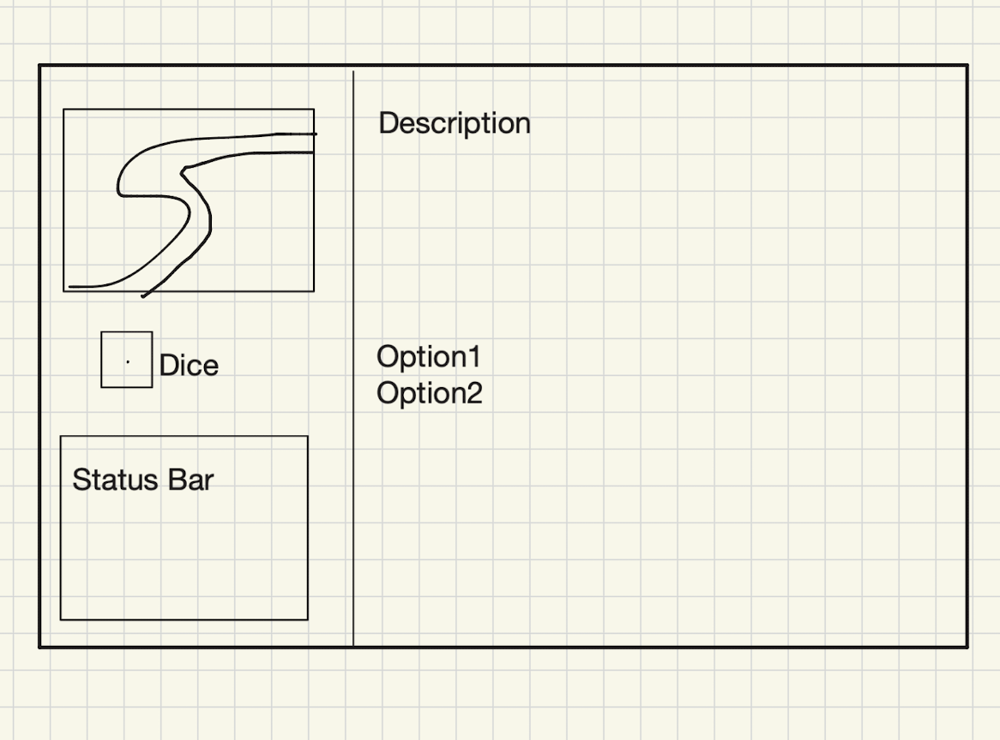

# Wellesley-Zombie-Apocalypse

A text-based survival game set on Wellesley College campus during a zombie apocalypse. Make strategic choices to survive, balancing your HP and aggressiveness as you navigate different locations and encounter various challenges.

## Pitch

Our team is developing a command-line, choose-your-own-adventure game. In each round, players roll a die to determine their next location, and each location triggers a unique event. At the end of the game, players receive different endings and achievements based on their final status, such as HP and aggressiveness.

## Description

Wellesley Zombie Apocalypse is an interactive text adventure game where the campus has been overrun by zombies. You begin with 100 HP and must navigate through various locations on campus by rolling dice to move forward. At each location, you face different situations and choices that affect your HP and aggressiveness levels. Your decisions shape your survival story and determine which of multiple unique endings you receive. The game features probabilistic outcomes, different encounter types, and a branching narrative system based on your stats.

## Wireframe



## Getting Started

### Dependencies

* Java 8 or higher
* Command line/terminal access

### Installing

1. Clone or download the repository
2. Navigate to the project directory:
   ```
   cd /path/to/Wellesley-Zombie-Apocalypse
   ```

### Executing program

1. Compile all Java files:
   ```
   javac *.java
   ```

2. Run the game:
   ```
   java Driver
   ```

3. Follow the on-screen prompts to navigate through the game by pressing Enter to roll the dice at each location

## Gameplay

* **HP (Health Points)**: Your strength, stamina, and will to keep going (starts at 100)
* **Aggressiveness**: How far you're willing to go to survive (starts at 20)
* **Dice Roll**: Controls how many locations you advance forward each turn
* **Choices**: At each location, select from available options that have different consequences for your stats
* **Endings**: Multiple unique endings based on your final HP, aggressiveness level, and alive status

## Game Features

* Multiple location encounters across Wellesley College campus
* Dynamic consequence system with both deterministic and probabilistic outcomes
* Stat-based ending system with unique achievement names and descriptions
* Immersive narrative and atmospheric storytelling
* Replayability with different outcome paths based on player choices

## Help

If the game doesn't compile, ensure all `.java` files are in the same directory and you have Java installed. Check your Java version with:
```
java -version
```

## Authors

[Angelina](https://github.com/azurex084-cpu)
[Loza](https://github.com/lozabek)
[Tracy](https://github.com/notracc1210)


## License

This project is licensed under the MIT License

## Acknowledgments

Special mention to Wellesley College for the inspiration and setting.
